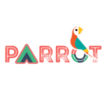

<p align="center" ></p>

<p align="center">
<a href="https://packagist.org/packages/laravel-parrot/laravel-parrot-setup"></a>
<a href="https://packagist.org/packages/laravel-parrot/laravel-parrot-setup"></a>
<a href="https://packagist.org/packages/laravel-parrot/laravel-parrot-setup"></a>
</p>

# `laravel-parrot-setup`

A Parrot Project for laravel (vue) dev.

# Installation

~ Follow step by step

```bash
composer require laravel-parrot/laravel-parrot-setup
```

* parrot project command
```bash
laravel-parrot:parrot
```

* command for add parrot json with composer.json
```bash
laravel-parrot:setup
```
* composer merge
```bash
composer update -vv
```
* composer dump-autoload
```bash
composer dump-autoload
```
* add parrot project  provider
```bash
laravel-parrot:provider
```

# .

<a href="https://twitter.com/0devco" target="_blank" ><p align="center" ></p></a>
